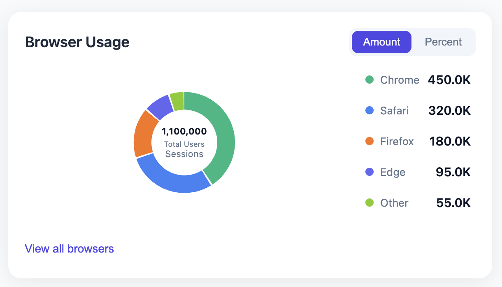
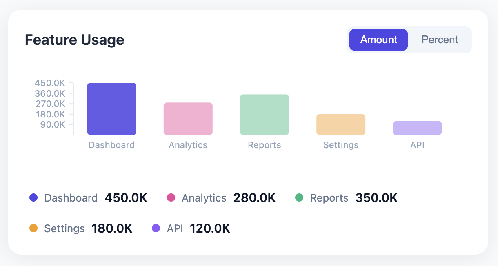

# ChartKit

**Pure JavaScript charting library — zero dependencies, SVG-based, fully customizable.**

ChartKit renders beautiful Donut, Pie, and Bar charts using vanilla JavaScript, CSS, and SVG. Designed for scenarios where a backend (e.g., Java) generates HTML elements with data attributes, or for direct programmatic use via a clean JavaScript API.

---

## Features

- **Donut / Pie / Bar charts** — SVG-rendered, resolution-independent
- **Dual API** — HTML data attributes (backend-generated) or JavaScript API
- **RTL / LTR support** — Auto-detects `dir` attribute, toggle at runtime
- **Fully customizable** — Colors, fonts, sizes, radii, gaps via CSS custom properties
- **Responsive** — ResizeObserver-based, adapts to container size
- **Animated** — Entry animations with configurable duration and easing
- **Realtime updates** — `chart.updateData()` with smooth transitions
- **Type switching** — Switch between chart types at runtime
- **Toggle component** — Amount / Percent view toggle built-in
- **Legend** — Positionable (right, left, bottom), auto-generated
- **"Others" grouping** — Threshold-based grouping for small segments
- **Tooltips** — Hover tooltips with label and formatted value
- **Center content slot** — Custom content in donut hole
- **Footer action** — Configurable button with click handler
- **No dependencies** — Pure JavaScript (ES6+), no frameworks required

---

## Demo

<p align="center">
  <strong>Donut Chart</strong><br>
  
</p>

<p align="center">
  <strong>Bar Chart</strong><br>
  
</p>

> Open `examples/index.html` in a browser to see live interactive charts.

---

## Installation

### Via script tag (IIFE)

```html
<script src="dist/chartkit.min.js"></script>
```

The library auto-discovers elements with `data-ck-type` on `DOMContentLoaded`.

### Via ES modules

```javascript
import ChartKit from './dist/chartkit.esm.js';
```

### Via npm (coming soon)

```bash
npm install chartkit
```

---

## Quick Start

### HTML Attribute API

The simplest approach — add `data-ck-*` attributes to any `<div>`:

```html
<div class="ck-chart"
     data-ck-type="donut"
     data-ck-title="Portfolio Allocation"
     data-ck-data='[
       {"id":"eq","label":"Equities","value":450,"color":"#4F46E5"},
       {"id":"fi","label":"Fixed Income","value":320,"color":"#7C3AED"},
       {"id":"ca","label":"Cash","value":95,"color":"#10B981"}
     ]'
     data-ck-center-label="Total Value"
     data-ck-center-value="865"
     data-ck-center-unit="K USD"
     data-ck-show-toggle="true"
     data-ck-toggle-options='[{"label":"Amount","value":"amount"},{"label":"Percent","value":"percent"}]'
     data-ck-footer-label="View Details"
     data-ck-direction="ltr"
     data-ck-inner-radius="0.65"
     data-ck-segment-gap="2"
     data-ck-others-threshold="5">
</div>
```

### JavaScript API

```javascript
const chart = ChartKit.create(document.getElementById('my-chart'), {
  type: 'donut',
  title: 'Portfolio Allocation',
  data: [
    { id: 'eq', label: 'Equities', value: 450, color: '#4F46E5' },
    { id: 'fi', label: 'Fixed Income', value: 320, color: '#7C3AED' },
    { id: 'ca', label: 'Cash', value: 95, color: '#10B981' },
  ],
  centerContent: {
    label: 'Total Value',
    value: '865',
    unit: 'K USD',
  },
  toggle: {
    show: true,
    options: [
      { label: 'Amount', value: 'amount' },
      { label: 'Percent', value: 'percent' },
    ],
  },
  legend: { position: 'right', show: true },
  footer: { label: 'View Details', onClick: () => alert('Details') },
  animation: { enabled: true, duration: 800 },
  innerRadius: 0.65,
  segmentGap: 2,
  othersThreshold: 5,
  direction: 'ltr',
  responsive: true,
});
```

### Programmatic Auto-Discovery

```javascript
// Auto-detect all [data-ck-type] elements on page
ChartKit.autoInit();

// Auto-detect within a specific container
ChartKit.autoInit(document.getElementById('dashboard'));
```

---

## API Reference

### `ChartKit.create(element, config)`

Creates a chart instance on the given DOM element.

| Param | Type | Description |
|-------|------|-------------|
| `element` | `Element \| string` | DOM element or CSS selector |
| `config` | `Object` | Chart configuration (see below) |

Returns a chart instance with the following methods:

#### Instance Methods

| Method | Description |
|--------|-------------|
| `render()` | Force re-render |
| `updateData(newData)` | Update chart data with smooth animation |
| `setType(type)` | Switch chart type (`'donut'` / `'pie'` / `'bar'`) |
| `setDirection(direction)` | Set `'ltr'` or `'rtl'` |
| `getConfig()` | Get current configuration |
| `getDirection()` | Get current direction |
| `getContainer()` | Get the root DOM element |
| `destroy()` | Remove chart and clean up |

#### Events

```javascript
chart.on('update', ({ data }) => { /* data changed */ });
chart.on('typechange', ({ type }) => { /* type switched */ });
chart.on('destroy', () => { /* chart destroyed */ });
```

---

## Configuration Reference

### Top-Level Config

| Property | Type | Default | Description |
|----------|------|---------|-------------|
| `type` | `string` | `'donut'` | Chart type: `'donut'`, `'pie'`, `'bar'` |
| `title` | `string` | `''` | Chart title in header |
| `direction` | `string` | detected | Text direction: `'ltr'` or `'rtl'` |
| `responsive` | `boolean` | `true` | Enable resize observation |
| `innerRadius` | `number` | `0.65` | Inner radius ratio for donut (0 = pie, >0 = donut) |
| `segmentGap` | `number` | `2` | Gap between donut segments in SVG units |
| `othersThreshold` | `number` | `5` | Percentage threshold for "Others" grouping (0 = disabled) |

### Data Format

```javascript
data: [
  {
    id: 'unique-key',       // (optional) Unique identifier
    label: 'Display Name',  // (optional) Display name, defaults to String(value)
    value: 450,             // Numeric value (required)
    color: '#4F46E5',       // (optional) Segment color, uses palette if omitted
  },
]
```

### `centerContent` (Donut/Pie only)

| Property | Type | Description |
|----------|------|-------------|
| `label` | `string` | Text shown below the value |
| `value` | `string` | Large central value text |
| `unit` | `string` | Unit text below the label |

### `legend`

| Property | Type | Default | Description |
|----------|------|---------|-------------|
| `show` | `boolean` | `true` | Show or hide the legend |
| `position` | `string` | `'right'` | `'right'`, `'left'`, or `'bottom'` |

### `toggle`

| Property | Type | Description |
|----------|------|-------------|
| `show` | `boolean` | Show or hide toggle |
| `options` | `Array<{label, value}>` | Toggle options (minimum 2) |

### `footer`

| Property | Type | Description |
|----------|------|-------------|
| `label` | `string` | Button text |
| `onClick` | `function` | Click handler |

### `animation`

| Property | Type | Default | Description |
|----------|------|---------|-------------|
| `enabled` | `boolean` | `true` | Enable animations |
| `duration` | `number` | `800` | Animation duration in ms |

### `theme`

Custom CSS custom properties object. Overrides design tokens:

```javascript
theme: {
  fontFamily: '"Segoe UI", sans-serif',
  primaryColor: '#6366F1',
  cardRadius: '12px',
  cardShadow: '0 2px 12px rgba(0,0,0,0.1)',
}
```

---

## HTML Data Attributes

All configuration can be set via `data-ck-*` attributes:

| Attribute | Equivalent Config |
|-----------|------------------|
| `data-ck-type` | `type` |
| `data-ck-title` | `title` |
| `data-ck-data` | `data` (JSON string) |
| `data-ck-direction` | `direction` |
| `data-ck-inner-radius` | `innerRadius` |
| `data-ck-segment-gap` | `segmentGap` |
| `data-ck-others-threshold` | `othersThreshold` |
| `data-ck-center-label` | `centerContent.label` |
| `data-ck-center-value` | `centerContent.value` |
| `data-ck-center-unit` | `centerContent.unit` |
| `data-ck-show-legend` | `legend.show` |
| `data-ck-legend-position` | `legend.position` |
| `data-ck-show-toggle` | `toggle.show` |
| `data-ck-toggle-options` | `toggle.options` (JSON string) |
| `data-ck-footer-label` | `footer.label` |
| `data-ck-animation` | `animation.enabled` |
| `data-ck-animation-duration` | `animation.duration` |
| `data-ck-responsive` | `responsive` |

---

## Theming with CSS Custom Properties

Customize the entire visual appearance by overriding CSS custom properties:

```css
.ck-chart {
  --ck-font-family: 'Inter', sans-serif;
  --ck-card-background: #1E293B;
  --ck-card-radius: 12px;
  --ck-card-shadow: 0 4px 32px rgba(0, 0, 0, 0.3);
  --ck-title-color: #F8FAFC;
  --ck-text-color: #94A3B8;
  --ck-value-color: #E2E8F0;
  --ck-toggle-active-bg: #6366F1;
  --ck-toggle-inactive-bg: #334155;
  --ck-toggle-inactive-color: #94A3B8;
  --ck-tooltip-bg: #0F172A;
  --ck-segment-gap-color: #1E293B;
  --ck-footer-color: #818CF8;
}
```

### Full list of CSS custom properties

| Property | Default | Description |
|----------|---------|-------------|
| `--ck-font-family` | System font stack | Font family |
| `--ck-title-size` | `18px` | Title font size |
| `--ck-title-weight` | `600` | Title font weight |
| `--ck-title-color` | `#1E293B` | Title text color |
| `--ck-text-color` | `#64748B` | General text color |
| `--ck-text-size` | `13px` | General text size |
| `--ck-value-size` | `15px` | Value text size |
| `--ck-value-weight` | `600` | Value font weight |
| `--ck-value-color` | `#0F172A` | Value text color |
| `--ck-card-background` | `#FFFFFF` | Card background |
| `--ck-card-radius` | `16px` | Card border radius |
| `--ck-card-shadow` | Complex | Card box shadow |
| `--ck-card-padding` | `20px` | Card internal padding |
| `--ck-toggle-active-bg` | `#4F46E5` | Active toggle background |
| `--ck-toggle-active-color` | `#FFFFFF` | Active toggle text |
| `--ck-toggle-inactive-bg` | `#F1F5F9` | Inactive toggle background |
| `--ck-toggle-inactive-color` | `#64748B` | Inactive toggle text |
| `--ck-toggle-radius` | `8px` | Toggle border radius |
| `--ck-legend-dot-size` | `10px` | Legend dot size |
| `--ck-legend-gap` | `12px` | Legend item gap |
| `--ck-segment-gap-color` | `#FFFFFF` | Segment gap color |
| `--ck-tooltip-bg` | `#1E293B` | Tooltip background |
| `--ck-tooltip-color` | `#FFFFFF` | Tooltip text color |
| `--ck-tooltip-radius` | `8px` | Tooltip border radius |
| `--ck-footer-color` | `#4F46E5` | Footer button color |
| `--ck-footer-weight` | `500` | Footer font weight |
| `--ck-transition-duration` | `300ms` | Transition duration |

---

## RTL / LTR

ChartKit automatically detects the text direction from:

1. The element's `dir` attribute
2. The nearest ancestor's `dir` attribute
3. The `<html>` element's `dir` attribute
4. Defaults to `'ltr'`

### Set direction explicitly

```javascript
chart.setDirection('rtl');
```

### In HTML

```html
<div class="ck-chart" data-ck-type="donut" dir="rtl" ...>
```

When in RTL mode, the legend position flips automatically (right ↔ left) and the layout adjusts.

---

## Responsive Behavior

ChartKit uses `ResizeObserver` to detect container size changes and re-renders automatically:

- Donut/Pie charts scale to fit the available space
- Bar charts recalculate bar widths and positions
- On small screens (<480px), the legend moves below the chart
- Disable with `responsive: false` or `data-ck-responsive="false"`

---

## Real-Time Updates

```javascript
// Update chart data — smooth animation
setInterval(() => {
  data[0].value = Math.random() * 100;
  chart.updateData([...data]);
}, 2000);
```

The `updateData()` method re-renders the chart with the new data while preserving the current configuration.

---

## Architecture

ChartKit follows SOLID principles:

| Principle | Implementation |
|-----------|---------------|
| **S** — Single Responsibility | Each file has one purpose: `Chart.js` (lifecycle), `SVGRenderer.js` (drawing), `Animator.js` (animations), etc. |
| **O** — Open/Closed | New chart types register via `ChartFactory` without modifying existing code |
| **L** — Liskov Substitution | All chart types implement the same interface: `render()`, `updateData()`, `destroy()` |
| **I** — Interface Segregation | Config is split into logical groups: data, visual, legend, animation, etc. |
| **D** — Dependency Inversion | Components depend on abstractions (`Renderer`, `Animator`) not concrete implementations |

### File Structure

```
js-chart-library/
├── src/
│   ├── index.js                  # Entry point, public API
│   ├── constants.js              # All named constants
│   ├── core/                     # Framework: base classes, factory, config
│   ├── charts/                   # Chart implementations
│   ├── components/               # Reusable UI pieces
│   ├── rendering/                # SVG rendering engine
│   ├── animation/                # Animation engine
│   ├── utils/                    # Pure utility functions
│   └── types/                    # Validation and schema
├── styles/                       # CSS files
├── dist/                         # Built bundles
├── examples/                     # Demo pages
└── tests/                        # Test suite
```

---

## Browser Support

ChartsKit works in all modern browsers that support ES6+, SVG, and ResizeObserver:

- Chrome 64+
- Firefox 69+
- Safari 13.1+
- Edge 79+

---

## License

MIT
